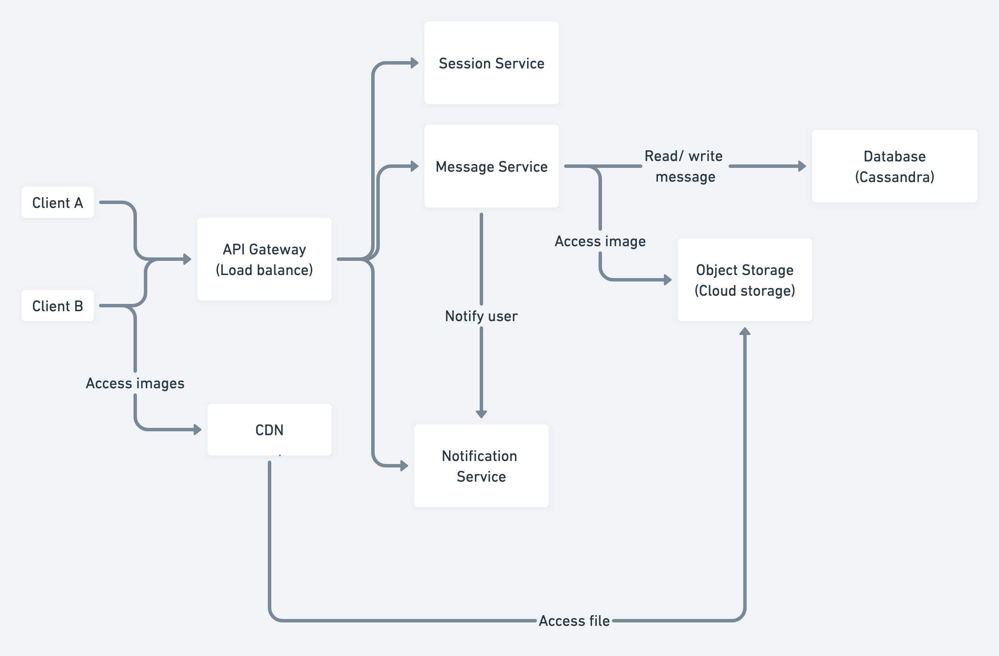

# 線上通訊服務

## Feature
1. Able to send and receive messages between two users. Support formats:
    - Text
    - Image
2. Receipts for sent, delivered and read status

## Specification
1. Large traffic: 1M messages/day
2. Read/Write ratio: 50/50
3. Large storage: store message at least for 1 year
4. Easy to scale and low cost to maintenance: Cassandra

## Data

```sql
CREATE TABLE messages (
  message_id bigint,
  room_id bigint,
  user_id bigint,
  receipt_status int,
  content text,
  PRIMARY KEY (room_id, message_id)
) WITH CLUSTERING ORDER BY (message_id DESC);

CREATE TABLE rooms (
  room_id bigint,
  users list<text>,
  content text,
  PRIMARY KEY (room_id)
);

```

## Overview

